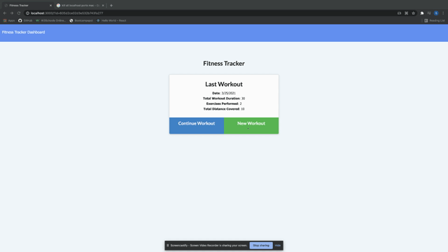

# Exercise Tracker

## Description

This application uses mongodb, javascript, and RESTfull design to allow the user to add, track, and view exercises.

## Table of contents

- [General Info](#general-info)
- [Demo](#demo)
- [Technologies](#technologies)
- [Author](#author)
- [Questions](#questions)

## General Info

This application is deployed [here](https://stormy-sea-50426.herokuapp.com/?id=605669af1772880015bd3a30) on heroku.

## Demo

## Technologies

This project was created with:

- [JavaScript](https://www.javascript.com/)

- [JQuery](https://jquery.com/)

- [Express](https://www.npmjs.com/package/express)

- [Node](https://www.npmjs.com/package/node)

- [MongoDB](https://www.mongodb.com/)

## Author

- [Shawn Flanigan](https://github.com/Shawnmflanigan/welcome_to_wimpys)

## Questions

- If you have any questions about installing this application locally please feel free to reach out to me [here](theshawns@gmail.com)
